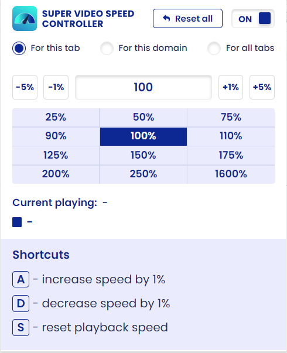

## 前言
&nbsp;&nbsp;&nbsp;&nbsp;&nbsp;&nbsp;&nbsp;&nbsp;以下插件是个人经常使用的几个Google浏览器插件，现在分享给大家。文章是原创的，如果有雷同，纯属巧合。此外，日后发现好用的插件时会不断更新博客。 
&nbsp;&nbsp;&nbsp;&nbsp;&nbsp;&nbsp;&nbsp;&nbsp;个人将插件划分为两种：**开发插件**和**日常插件**。其中开发插件是在编程中使用的插件，特别是前端开发；日常插件则是日常生活中很便利的插件。
## 1.开发插件
### 1.1 React Developer Tools

&nbsp;&nbsp;&nbsp;&nbsp;&nbsp;&nbsp;&nbsp;&nbsp;React Developer Tools是一个由Facebook开发的浏览器扩展，用于帮助React开发者调试和分析他们的React应用程序。这个工具可用于Chrome和Firefox等主流浏览器。 
&nbsp;&nbsp;&nbsp;&nbsp;&nbsp;&nbsp;&nbsp;&nbsp;React Developer Tools提供了一组功能，使开发者能够更轻松地查看和理解他们的React组件层次结构，以及监视应用程序状态的变化。以下是一些React Developer Tools的主要功能：

- 组件树： 显示应用程序中所有React组件的层次结构，使开发者能够轻松地浏览和了解组件的嵌套关系。
- 组件状态和属性： 允许开发者检查每个组件的当前状态和属性，帮助定位和解决潜在的问题。
- 组件性能： 提供性能分析工具，可以帮助开发者识别和优化渲染性能方面的问题。
- 状态管理： 允许开发者检查和修改应用程序的状态，以及随时追踪状态的变化。
- 时间旅行调试： 允许开发者在应用程序的不同状态之间进行时间旅行，以便更容易地追踪问题的根本原因。

### 1.2 Vue.js devtools

&nbsp;&nbsp;&nbsp;&nbsp;&nbsp;&nbsp;&nbsp;&nbsp;Vue.js Devtools是一个由Vue.js官方提供的浏览器扩展，用于帮助Vue.js开发者调试和分析他们的Vue.js应用程序。类似于React Developer Tools，Vue.js Devtools提供了一系列功能，以便开发者更轻松地理解和调试他们的Vue.js应用。
以下是Vue.js Devtools的一些主要功能：

- 组件树： 显示应用程序中所有Vue组件的层次结构，使开发者能够轻松地浏览和了解组件的嵌套关系。
- 组件状态和属性： 允许开发者检查每个组件的当前状态和属性，帮助定位和解决潜在的问题。
- 事件追踪： 提供一个事件追踪器，可以显示应用程序中发生的事件，帮助开发者理解和调试事件的流程。
- Vuex状态管理： 如果应用程序使用了Vuex进行状态管理，Vue.js Devtools还提供了与Vuex集成的功能，允许开发者检查和修改Vuex中的状态。
- 性能监控： 提供性能监控工具，帮助开发者识别和优化渲染性能方面的问题。

Vue.js Devtools通过提供这些功能，使开发者能够更方便地诊断和调试Vue.js应用程序，提高开发效率。这个工具是Vue.js生态系统中的一个重要组成部分，可以在Chrome和Firefox等主流浏览器中使用。
### 1.3 Tabbed Postman - REST Client

&nbsp;&nbsp;&nbsp;&nbsp;&nbsp;&nbsp;&nbsp;&nbsp;Tabbed Postman - REST Client是Postman的Chrome 浏览器扩展版本之一。我们不需要下载Postman就可以测试后端的API。该插件的主要特点和功能如下：

- 用户界面： 提供直观的用户界面，使用选项卡来组织和管理不同的 API 请求。每个选项卡都可以包含一个完整的 API 请求，包括请求头、请求体、参数等。
- 请求构建： 允许用户轻松地构建 HTTP 请求，支持常见的请求方法（GET、POST、PUT、DELETE 等）和各种请求参数。
- 环境变量和全局变量： 支持定义环境变量和全局变量，使得可以轻松地在不同的环境中测试 API 请求。
- 历史记录： 保存并展示用户之前发送的 API 请求的历史记录，方便查看和重新执行之前的请求。
- 测试脚本： 允许用户编写测试脚本，用于验证 API 响应是否符合预期，并执行在请求后自动运行的操作。
- 集成 Postman Collections： 可以导入和使用 Postman Collections，这是一个用于组织和共享 API 请求的结构化方式。
- 导出和共享： 支持导出和共享 API 请求，以便团队成员之间或在不同环境中分享测试用例。

### 1.4 JSON Formatter

&nbsp;&nbsp;&nbsp;&nbsp;&nbsp;&nbsp;&nbsp;&nbsp;这是一款JSON格式化工具，能够将格式混乱的json数据转换成我们更容易观看的格式，方便我们对数据进行分析。个人也写了一个JSON格式化工具，如果想使用的话可以进入我个人的网站，然后点击实用工具模块，就能够使用该工具了。

## 2.日常插件
### 2.1 AdBlock

&nbsp;&nbsp;&nbsp;&nbsp;&nbsp;&nbsp;&nbsp;&nbsp;这是一款浏览器的广告拦截工具，在google、edge等主流的浏览器都能够使用，正如图片上所说的，能够拦截youtube、facebook和喜欢的网站上的广告和弹窗。本人亲测过，该插件确实能够拦截很多广告和弹窗，但是在youtube拦截广告会被识别，然后youtube会弹出一个弹窗，需要手动关闭。

### 2.2 DeepL翻译

&nbsp;&nbsp;&nbsp;&nbsp;&nbsp;&nbsp;&nbsp;&nbsp;这是一个在线翻译的插件，我们只需要选中需要翻译的内容，它就会自动翻译。这个插件能够翻译多国语言，是一个很好用的插件。

### 2.3 Imagus

&nbsp;&nbsp;&nbsp;&nbsp;&nbsp;&nbsp;&nbsp;&nbsp;Imagus是一个图片放大器，我们只需要把鼠标放到图片上，它就会自动将图片放大。我们在查找图片、在京东和淘宝等网站购物时，这个插件就会显得十分好用，因为我们不需要点开图片就可以查看一些细节。

### 2.4 Super 视频加速

&nbsp;&nbsp;&nbsp;&nbsp;&nbsp;&nbsp;&nbsp;&nbsp;Super 视频加速插件最高能够将视频以16倍速进行播放。当然我们可以自定义倍速，比如1.6、1.8倍。对于经常刷b站的朋友来说，这个插件非常好用，不再局限与官网给的几个固定的选择了。对于学生来说，这个插件用来应付网课是个很好的选择。重点是：
不同页面中的视频速度不会相互影响。

### 2.5 Volume Master

&nbsp;&nbsp;&nbsp;&nbsp;&nbsp;&nbsp;&nbsp;&nbsp;Volume Master是一个控制音量的插件，这个插件能够实现不同页面之间的音量是不同的。比如b站的视频的音量是正常音量，另外一个页面是youtube的视频，我们使用这个插件调到2倍音量，这两个页面的视频可以各自播放不会相互影响，是一个很好的插件。

## 总结
&nbsp;&nbsp;&nbsp;&nbsp;&nbsp;&nbsp;&nbsp;&nbsp;Google浏览器中好用的插件就分享这么多，之后如果发现更多好用的插件，那么我会继续更新这篇博客，或者重新再写一篇相关的博客。