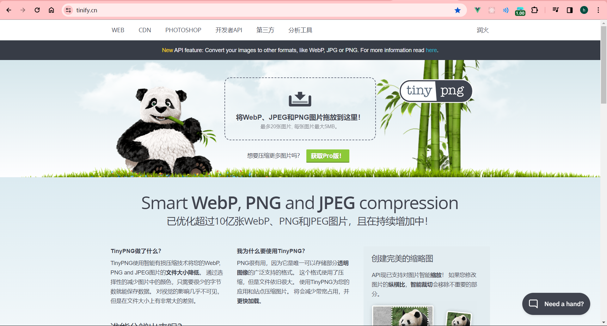
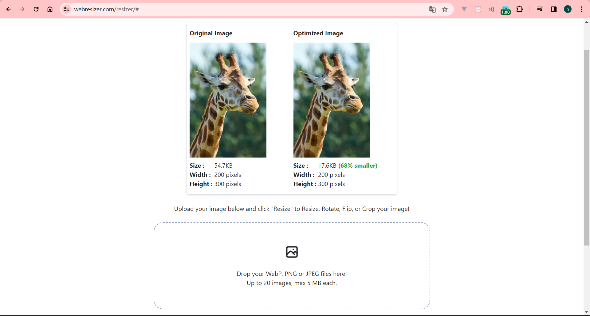
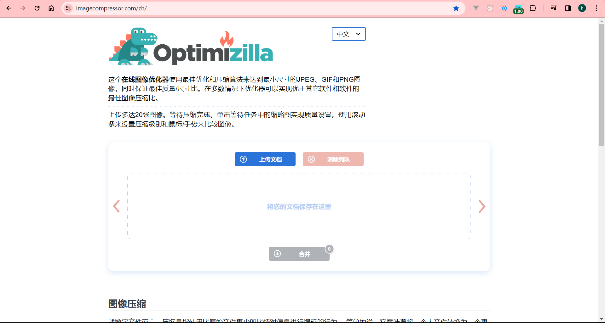

# 前言
&nbsp;&nbsp;&nbsp;&nbsp;&nbsp;&nbsp;&nbsp;&nbsp;在项目开发的过程中，有时候需要压缩一些不重要的图片。下面介绍几款非常好用的在线图像压缩工具：
# 工具
## TinyPNG
&nbsp;&nbsp;&nbsp;&nbsp;&nbsp;&nbsp;&nbsp;&nbsp;TinyPNG是一个在线图像压缩工具，专门用于减小PNG格式图像文件的大小而不损失图像质量。
TinyPNG利用先进的压缩算法，通过删除图像中的一些冗余信息来减小文件大小，同时保持图像在肉眼可见的程度上的质量。TinyPNG目前支持PNG、JPEG、WEBP等
格式的图片。 
**工具地址：** <a href="https://tinify.cn" target="_blank">https://tinify.cn</a>

**优点**
- 能够保证图片在肉眼可见的程度上的质量；
- API丰富，支持JAVA、PHP、Python多种语言，并且支持本地压缩；
- API每个月有500次免费，之后的价格也相对比较便宜；

**缺点**
- 每次最多压缩20张照片（本人亲测，刷新后可以继续使用，哈哈哈哈）；
- 压缩的图片大小不能超过5MB，如果自己使用API，那么没有这个限制；

## Web Resizer
&nbsp;&nbsp;&nbsp;&nbsp;&nbsp;&nbsp;&nbsp;&nbsp;Web Resizer也是一种在线图像压缩工具，支持PNG、JPEG、WEBP等格式的图片。不过相对TinyPNG而言，压缩后的图片质量相对会差点，
不过有一个好处就是，Web Resizer支持在线调整图片的大小，TinyPNG只能使用API时才提供这个功能。 
**工具地址：**<a href="https://www.webresizer.com/resizer" target="_blank">https://www.webresizer.com/resizer</a> 

**优点**
- 支持在线调整图片的大小和位置；

**缺点**
- 每次最多只能压缩20张图片，图片大小不能超过5MB；

## Optimizilla
&nbsp;&nbsp;&nbsp;&nbsp;&nbsp;&nbsp;&nbsp;&nbsp;这款图片压缩工具与前两者有所不同，它支持的图片格式有JPEG、PNG和GIF。除此之外，这款工具
有一个前两者都没有的优点，就是可以手动控制图片的质量，可以根据自己的需求来决定压缩质量。
**工具地址：** <a href="https://imagecompressor.com/zh/" target="_blank">https://imagecompressor.com/zh/</a>

**优点**
- 支持动图的压缩；
- 手动控制压缩质量，并将预期的结果呈现出来；
- 图片大小不限制；

**缺点**
- 每次最多只能压缩20张图片；

# 总结
&nbsp;&nbsp;&nbsp;&nbsp;&nbsp;&nbsp;&nbsp;&nbsp;这些工具各有优点，可以根据自己的需求来决定使用。这里提供一个使用场景，假如我要压缩一个10M的图片，
那么可以先使用Optimizilla工具压缩，然后再使用TinyPNG压缩。因为不同工具的压缩算法不同，这样使用也许能够将图片压缩的很小，哈哈哈哈！！！